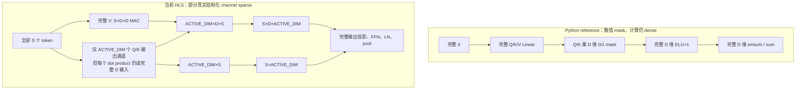

# Real Event Sparse Step 1：当前 Attention 计算与存储流静态审计

## 1. 范围与结论

本文只对当前源码和已有 Vitis HLS 报告做静态分析，没有修改实现，也没有运行 HLS、Vivado 或 PYNQ。行号以当前工作区文件为准。

核心结论如下。

1. `src/transformer.py` 中的 Linear Transformer 是完全 dense 的：Q/K/V、φ(Q)/φ(K)、`K^T V`、normalizer、attended 和输出投影都对完整 token/channel 张量执行。
2. 实验一 Python reference/codegen 中的 channel mask 是“数值 mask”，不会改变 PyTorch `Linear`/`einsum` 的维度或迭代次数，因此不会直接降低 FPGA latency。更严重的是，当前两个 reference 实现先把 Q/K 置零、再执行 `ELU(x)+1`，被 mask 的零会变成 1；因此该写法甚至没有保持 inactive φ(Q)/φ(K) 为零。
3. 当前上板 HLS 不是纯粹的 mask=0：Q16 sparse 与当前 Q8-S30 源码在 Q/K 输出通道、`K^T V` 的 K 通道、`K_sum`、normalizer 和 attended reduction 上使用编译期 `ACTIVE_DIM`，确实减少了这些循环的 iteration/MAC/BRAM access。
4. 但 HLS 仍遍历全部 `SEQ_LEN=16` token；输入投影、V 投影、attention 输出投影、两层 FFN、两次 LayerNorm、pooling、classifier 也保持 dense。它是“部分结构化 channel sparsity”，不是事件驱动 token sparsity。
5. 真正降低事件稀疏 latency 的必要条件是：让有效事件/token 数进入 HLS 控制路径，并把所有受 token 数支配的循环上界从 `SEQ_LEN` 改为有效数量（或压缩后的连续 event list）；仅将无效 token/channel 写成 0，循环、MAC 调度和存储访问仍会发生。

## 2. 当前 Dense / Mask Sparse 数据流图

### 2.1 Dense Linear Transformer

```mermaid
flowchart LR
    I[输入: S×INPUT_DIM] --> E[输入投影 + 位置编码\nS×D]
    E --> Q[Q = XWq]
    E --> K[K = XWk]
    E --> V[V = XWv]
    Q --> PQ[φ(Q) = ELU(Q)+1]
    K --> PK[φ(K) = ELU(K)+1]
    PK --> KV[KV = φ(K)^T V\nD×D]
    V --> KV
    PK --> KS[K_sum = Σtoken φ(K)]
    PQ --> N[normalizer = φ(Q) K_sum]
    KS --> N
    PQ --> A[attended = φ(Q) KV / normalizer]
    KV --> A
    N --> A
    A --> O[Dense output projection + residual]
    O --> LN1[LayerNorm]
    LN1 --> FF[Dense FFN 16→32→16 + residual]
    FF --> LN2[LayerNorm]
    LN2 --> P[Dense mean pool over all tokens]
    P --> C[Classifier]
```

PyTorch 定义对应 `src/transformer.py:584-607`；完整 backbone 的输入投影、encoder、pooling 和 classifier 位于 `src/transformer.py:646-675`。

### 2.2 当前 Python mask sparse 与当前 HLS sparse



两者不能混为一谈：Python 的 mask 不缩短算子形状；HLS 的 `ACTIVE_DIM` 是编译期 loop bound，确实少执行一部分 channel iteration。但两者都不是基于事件数量动态减少 token iteration。

## 3. Q/K/V、φ 与 mask 的准确位置

### 3.1 Canonical PyTorch 模型

- Q/K/V 层定义：`src/transformer.py:584-587`。
- Q 和 φ(Q)：`src/transformer.py:598`，一个表达式先执行 dense `query(x)`，再执行 `_feature_map`。
- K 和 φ(K)：`src/transformer.py:599`。
- V：`src/transformer.py:600`。
- φ 定义为 `F.elu(x)+1.0`：`src/transformer.py:593-595`。
- `K^T V`、`K_sum`、normalizer、attended：`src/transformer.py:603-606`。
- 该类没有 sparse mask；所有 token/channel 都参与。

### 3.2 Python sparse reference/codegen

`build_all_sparse_configs.py` 中：

- dense Q/K/V projection：`build_all_sparse_configs.py:459-461`；
- mask 创建及应用：`build_all_sparse_configs.py:463-468`；
- φ(Q)/φ(K)：`build_all_sparse_configs.py:470-472`；
- dense `einsum`/reduction：`build_all_sparse_configs.py:474-481`；
- dense output projection、FFN、pool/classifier：`build_all_sparse_configs.py:483-502`。

独立 reference 生成脚本同样如此：

- mask：`gen_sparse_ref_logits.py:39-42`；
- dense Q/K/V：`gen_sparse_ref_logits.py:44-47`；
- mask 应用：`gen_sparse_ref_logits.py:49-51`；
- φ：`gen_sparse_ref_logits.py:53-55`；
- dense attention：`gen_sparse_ref_logits.py:57-68`；
- dense 后半段：`gen_sparse_ref_logits.py:70-89`。

这里存在一个必须记录的语义风险：mask 在 φ 之前应用，而 `φ(0)=ELU(0)+1=1`。因此 inactive Q/K channel 在进入 attention reduction 时不是 0。若目标是令 inactive feature channel 不参与，应当在 φ 之后 mask，或直接像 HLS 一样不生成/不遍历该通道。本文只指出问题，不修改代码。

另外，`build_all_sparse_configs.py:442-446` 在 sparse forward 异常时会回退到完全 dense `model(x)`；这可能让 reference 静默失去 sparse 语义。

### 3.3 当前 HLS

以 Q16-S30 为代表，Q16 S0/S10/S20/S30 的 C++ 主体相同，差别由各目录 `active_channels.h:10-13` 的编译期常量决定：S0=16、S10=14、S20=13、S30=11。当前 Q8-S30 的等价位置列在下一节。

- V 在 `imgds_linear_dense_q16.cpp:96-105` 生成，遍历全部 token、输出 channel 和输入 channel。
- Q/K 在 `imgds_linear_dense_q16.cpp:107-118` 生成；外层输出 channel 是 `ACTIVE_DIM`，内层 dot product 仍是完整 `D_MODEL`。
- φ(Q)/φ(K) 在写入 Q/K buffer 时执行：`imgds_linear_dense_q16.cpp:116-117`，φ 函数为 `:30-35`。
- HLS 不先生成完整 Q/K 再乘零 mask；它通过 `ACTIVE_CHANNELS[ii]` 和 `ii < ACTIVE_DIM` 跳过 inactive 输出 channel。这是 loop-bound sparsity。

当前 Q8-S30 的对应位置为：V `imgds_linear_dense_q8.cpp:80-89`，Q/K 与 φ `:91-102`，`ACTIVE_DIM` attention reduction `:107-151`。

## 4. 关键循环、MAC、存储访问和 latency 影响

下表以 Q16-S30 文件
`experiments/imgds_linear_sparse/final_paper_experiments/experiment1_sparse_board/hls_projects/q16_s30_attn_sparse/src/imgds_linear_dense_q16.cpp`
为行号基准。Q16 S0/S10/S20 的循环位置相同；其 `ACTIVE_DIM` 分别为 16/14/13。Q8-S30 结构等价，主要对应行号见表中括号。

| 阶段/循环 | Q16 行号（Q8-S30） | 当前 bound | MAC | 主要存储访问 | 当前是否可因 channel sparse 少迭代 | 对 latency 的判断 |
|---|---:|---|---|---|---|---|
| LayerNorm mean | 47-48（39-40） | `D_MODEL` | 否，仅加法 | x | 否 | 每 token 固定成本 |
| LayerNorm variance | 53-56（44-47） | `D_MODEL` | `diff*diff` | x | 否 | 每 token 固定成本 |
| LayerNorm affine | 65-68（54-57） | `D_MODEL` | scale multiply | x、gamma、beta | 否 | 每 token 固定成本 |
| attention token 外层 | 96（80） | `SEQ_LEN` | 包含下属全部 MAC | x、Q/K/V | 否 | 事件置零不会缩短；event count bound 才能缩短 |
| V projection | 98-104（82-88） | `D_MODEL×D_MODEL`/token | 102（86） | x、Wv、V | 否，完整 dense | attention 前段主要固定成本之一 |
| Q/K 输出 channel | 107-118（91-102） | `ACTIVE_DIM×D_MODEL`/token | 113-114（97-98） | x、Wq/Wk、Q/K | **是**，外层已缩短；内层 D 仍 dense | 已真实减少 channel iteration/latency |
| `KV=K^T V` | 123-133（107-117） | `ACTIVE_DIM×D_MODEL×SEQ_LEN` | 129（113） | K、V、KV | **是**，K channel 已缩短 | 已真实减少 MAC/BRAM access/latency |
| `K_sum` | 137-145（121-129） | `ACTIVE_DIM×SEQ_LEN` | 否，仅累加 | K、K_sum | **是** | 已减少 iteration/BRAM access |
| 每 token attention 输出 | 148-179（132-163） | `SEQ_LEN` | 包含下属 MAC | Q/K_sum/KV/attended/x | token 不可；内部 active dim 可 | token 稀疏尚未实现 |
| normalizer | 151-155（135-139） | `ACTIVE_DIM`/token | 154（138） | Q、K_sum | **是** | 已减少 latency |
| attended numerator | 161-168（145-152） | `D_MODEL×ACTIVE_DIM`/token | 166（150） | Q、KV、attended | **是**，仅 reduction 维缩短 | 已减少 latency，输出 D 仍完整 |
| output projection | 172-179（156-163） | `D_MODEL×D_MODEL`/token | 176（160） | attended、Wo、x | 否，完整 dense | mask=0 不会少周期；需结构化缩维/新接口 |
| FFN 16→32 | 194-205（179-190） | `SEQ_LEN×FF_DIM×D_MODEL` | 201（186） | x、W0、hidden | 否 | 大量固定 dense latency |
| FFN 32→16 | 209-216（194-201） | `SEQ_LEN×D_MODEL×FF_DIM` | 213（198） | hidden、W3、ff_out | 否 | 大量固定 dense latency |
| FF residual | 219-220（204-205） | `SEQ_LEN×D_MODEL` | 否 | x、ff_out | 否 | token 置零不减少访问 |
| 输入投影 | 245-253（225-233） | `SEQ_LEN×D_MODEL×INPUT_DIM` | 250（230） | AXI input、W、x、position ROM | 否 | 当前全模型最大的 dense 候选之一 |
| 两次 LayerNorm 调用 | 268-269、281-282（248-249、261-262） | 各 `SEQ_LEN` 次 | 是 | x、norm 参数 | 否 | event count bound 可直接减少调用次数 |
| mean pool | 286-293（266-273） | `D_MODEL×SEQ_LEN` | 否 | x、pooled | 否 | event-aware pooling 需同时改分母 |
| classifier | 297-304（277-285） | `N_CLASSES×D_MODEL`，unroll | 302（282） | pooled、classifier W、logits | 否 | 有 MAC/资源影响，因规模小且 unroll，latency 影响较小 |

已有 Q16-S30 HLS 报告提供了直接证据：

- `linear_attention_q16_sparse_csynth.rpt:52-61` 记录 `VITIS_LOOP_96_1` trip count 16、`VITIS_LOOP_107_4` trip count 11、`VITIS_LOOP_137_9` trip count 11、`VITIS_LOOP_148_11` trip count 16。即 token loop 保持 16，active-channel loop 变为 11。
- 同报告 `:26-33` 给出该 attention 函数 25,624 cycles；这说明这些串行/流水循环确实进入 latency 路径，而不只是软件层注释。
- 顶层 `imgds_linear_dense_q16_csynth.rpt:52-61` 显示输入投影 loop 为 20,736 cycles、FFN token loop 为 24,176 cycles；它们仍是 dense latency 的大头。

## 5. 哪些循环实际访问 BRAM

不能仅凭 C++ 局部数组断言它一定是 BRAM；HLS 可能映射为寄存器、LUTRAM 或 BRAM。这里依据已有 Q16-S30 csynth memory table 判断：

- `linear_attention_q16_sparse_csynth.rpt` 的 Memory 表将 Q、K、V、KV 各自映射为 1 个 BRAM_18K；因此 Q/K projection、KV、normalizer、attended、output projection 对这些数组的读写是实际 on-chip BRAM access。
- K_sum 和 attended 小数组被映射到 FF/LUT，而不是 BRAM；称其为 local-memory access 更准确。
- 顶层 `imgds_linear_dense_q16_csynth.rpt:142-155` 将 `x` 和 position embedding 各映射为 1 个 BRAM_18K；输入投影、attention、LayerNorm、FFN、pooling 对 `x` 的访问因此会形成 BRAM access。
- `input`/`logits` 由 `imgds_linear_dense_q16.cpp:232-236` 声明为 `m_axi`，是 PS/外部存储接口流量，不是上述 local BRAM。输入投影在 `:250` 读取 AXI input；`:304` 写 logits。
- 权重是常量数组，综合后可能进入 ROM、BRAM 或逻辑。报告显示部分大权重/位置常量为 BRAM ROM、部分小常量为 LUT/FF ROM；具体应以每个配置 csynth/implementation 报告为准，不能从 `.h` 或数组大小猜测。

因此，以下 loop-bound 缩短会同时减少已确认的 BRAM 访问：Q/K 输出通道 loop、KV active-channel loop、normalizer/attended 对 Q/KV 的读取；若未来缩短有效 token bound，还会减少 x、Q/K/V/KV 相关 BRAM 访问。单纯写 0 不会减少这些地址访问。

## 6. “假稀疏”问题说明

### 6.1 仅 mask=0 为什么不降低 latency

对于固定边界 HLS loop，`for (... < SEQ_LEN)` 或 `for (... < D_MODEL)` 的 trip count 在综合时已经确定。运行时数据为 0 不会自动取消：

- loop 控制和 iteration；
- weight/local buffer 读取；
- DSP/LUT multiplier 的调度；
- accumulator 更新；
- pipeline initiation interval 对应的周期。

除非显式加入条件跳过，并且硬件控制结构能产生周期级收益，否则零值只改变数值，不改变 schedule。即使加入 `if (mask)`，稀疏且不规则的分支也不必然比压缩索引 + 缩短 bound 更快。

当前 Python reference 的 `Linear`/`einsum` 尤其如此：mask 后张量 shape 仍是 `[B,S,D]`，所以底层 dense kernel 的工作量不变。它只能用于数值消融，不能证明硬件稀疏加速。

### 6.2 当前 HLS 真实减少了什么

`active_channels.h` 把 active channel 数编码为编译期常量：

- Q16-S0/Q8-S0：16；
- Q16-S10：14；
- Q16-S20：13；
- Q16-S30/Q8-S30：11。

所以 `ii < ACTIVE_DIM` 的五处 attention loop 是真实少迭代，不属于纯假稀疏。限制是：这只覆盖 attention 的 Q/K channel 轴，未覆盖 token 轴和模型其余 dense 模块。

### 6.3 codegen 状态风险

- Q16 codegen 以已有 Q16-S30 sparse C++ 为模板并替换 `active_channels.h`：`build_all_sparse_configs.py:181-206`。
- Q8 sparse 生成器只插入 header；源码自己写明复杂 loop replacement 尚未实现，并输出 “needs manual sparse attention loop insertion”：`build_all_sparse_configs.py:258-287`。当前工作区 Q8-S30 C++ 已经有手工加入的 `ACTIVE_DIM` loops，但重新执行这段生成器并不能可靠重建同样实现。
- Vivado/PYNQ 脚本生成只负责 IP/bitstream/package/driver 编排：`build_all_sparse_configs.py:511-591`。PYNQ runner 只做 buffer、寄存器 start/wait 和结果读取，不决定 kernel 内 MAC 或 loop bound。

## 7. 要真正降低 latency，应减少哪些 loop bound

### 7.1 优先级 A：事件/token 轴

若“事件稀疏”指部分 token 无事件，最高价值改动是建立压缩的有效 token 列表和 `N_ACTIVE_TOKENS`，让以下边界由 `SEQ_LEN` 变为有效 token 数：

1. 输入投影 `:245-253`；
2. Q/K/V 生成的 token 外层 `:96`；
3. KV 的 token reduction `:127-130`；
4. K_sum 的 token reduction `:140-143`；
5. per-position attention 输出 `:148-179`；
6. 两次 LayerNorm 的 token 调用 `:268-269,281-282`；
7. FFN token 外层 `:194`；
8. pooling 的 token reduction `:288-292`，并将除数从固定 `SEQ_LEN` 改为有效 token 数。

只有从最前端压缩 token，后续阶段才能避免为无效 token 生成 x/Q/K/V、访问 BRAM 并执行 MAC。若先做完整输入投影再压缩，已经无法回收输入投影的周期。

### 7.2 优先级 B：channel/feature 轴

当前 `ACTIVE_DIM` 已缩短 Q/K 输出 channel 和 attention reduction，但仍可分析：

- Q/K dot product 内层 `i<D_MODEL`：只有输入特征也有结构化稀疏/压缩格式时才能安全缩短；输出 channel 稀疏本身不能缩短这一内层。
- V projection `D_MODEL×D_MODEL`、attended/output projection、FFN：目前都没有 channel compression。若要缩短，必须形成跨层一致的 reduced dimension 或显式稀疏索引/权重布局，而不是只将 activation/weight 写 0。
- LayerNorm 与 residual 对维度语义敏感；随意删除 channel 会改变均值、方差和 residual shape，必须与模型训练/导出共同设计。

### 7.3 每个循环能否减少 iteration

- **可以立即由现有 active-channel 参数减少**：Q/K 输出 channel、KV K-channel、K_sum channel、normalizer channel、attended reduction channel；当前已实现。
- **可以由真实 event count 减少，但需修改数据表示和接口**：所有 `SEQ_LEN`/`pos`/`s` loops，包括输入投影、Q/K/V、KV/K_sum、per-token output、FFN、LayerNorm、pool。
- **不能仅凭现有 Q/K mask 减少**：V、output projection、FFN、LayerNorm、classifier 以及 Q/K dot-product 的输入维度。
- **理论可减少但需要模型级结构化重设计**：D_MODEL/FF_DIM loops、权重矩阵尺寸及 residual/norm 维度。

## 8. 对九个问题的直接回答

1. **Q/K/V 在哪里生成？** PyTorch 在 `transformer.py:598-600`；HLS Q16 的 V 在 `:96-105`，Q/K 在 `:107-118`；Q8-S30 对应 `:80-102`。
2. **φ(Q)、φ(K) 在哪里生成？** PyTorch `transformer.py:593-599`；HLS Q16 `:116-117` 调用 `:30-35`；Q8 `:100-101` 调用 `:23-28`。
3. **mask 在哪里应用？** canonical 模型没有 mask；Python reference 在 `build_all_sparse_configs.py:463-468` 和 `gen_sparse_ref_logits.py:39-55`；HLS 不乘 mask，而以 `ACTIVE_CHANNELS`/`ACTIVE_DIM` 截断输出 channel loop。
4. **是否仍遍历全部 token/channel？** 全部 token：是。全部 channel：V、输出投影、FFN、norm、pool 等是；Q/K 输出与 attention reduction 不是，它们只遍历 `ACTIVE_DIM`。
5. **哪些是 dense loop？** 表中所有 bound 为 `SEQ_LEN`、`D_MODEL`、`FF_DIM`、`INPUT_DIM` 且未换成 `ACTIVE_DIM` 的循环。
6. **哪些循环产生 MAC？** 输入投影、Q/K/V projection、KV、normalizer、attended、output projection、LayerNorm variance/affine、FFN、classifier；准确语句行见表。
7. **哪些循环访问 BRAM？** 报告确认访问 x、Q、K、V、KV 和部分 ROM 的相关循环；AXI input/output 另属外部 memory traffic。K_sum/attended 等小数组当前映射为 FF/LUT，不应笼统称 BRAM。
8. **哪里 mask=0 不会降低 latency？** 所有固定-bound dense Linear/einsum/HLS loop；尤其 Python reference 全部、HLS 中无效 token 的输入投影/V/output/FFN/LN/pool，以及任何仍遍历完整维度的乘加。
9. **哪里减少 loop bound 才能真正降低 latency？** 首要是所有 token 外层和 token reduction；其次是当前已用 `ACTIVE_DIM` 的五类 attention loops；要进一步缩短 V/output/FFN 则需结构化跨层缩维或压缩稀疏格式。

## 9. 最终判断

实验一当前实现应准确描述为：**Q/K active-channel structured sparse HLS with dense token processing and dense non-Q/K blocks**。它已经在局部 attention channel 轴产生真实少迭代，不宜全部称为“假稀疏”；但它还不是“真正事件稀疏”。

真正事件稀疏的第一设计约束应是：在进入输入投影之前得到有效事件索引/数量，使用压缩 token 序列贯穿 input projection、Q/K/V、attention、FFN、norm 和 pooling，并让硬件实际 trip count 随有效事件数下降。否则无论 mask 数值中有多少 0，固定 `SEQ_LEN` 调度仍会保留主要 latency 和 BRAM traffic。
