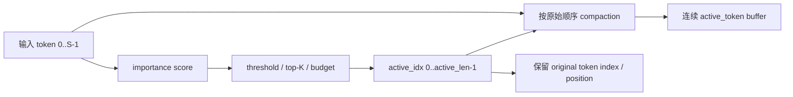
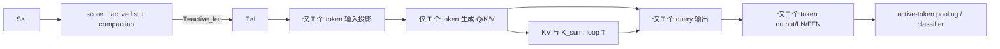
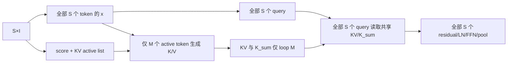
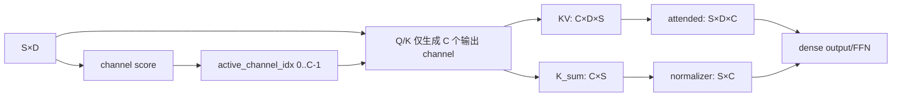

# Real Event Sparse Step 2：Event-driven Linear Attention 架构选择

## 1. 设计目标与硬约束

本文在 `docs/real_event_sparse_step1_attention_flow.md` 的静态审计基础上进行设计，不修改任何源码，也不运行 HLS、Vivado 或 PYNQ。

目标不是产生更多零值，而是让硬件实际执行的 loop iteration、MAC 和 memory access 随有效事件数下降。所有候选方案必须满足：

1. 先生成紧凑的 active index list；
2. 将 active 数据写入连续的 compacted buffer；
3. 后续计算使用 `active_len` 作为真实 loop bound；
4. 不允许执行完整循环后通过 `if (mask)` 丢弃输出；
5. 不允许对完整 channel/token 乘 0 后仍执行 dense MAC；
6. 稀疏收益必须能由 HLS loop trip count、MAC 数和存储访问数解释。

当前固定参数为：`SEQ_LEN S=16`、`INPUT_DIM I=64`、`D_MODEL D=16`、`FF_DIM F=32`。设计中的 buffer 可以按最大尺寸静态分配，以便综合；但有效数据必须只占前 `active_len` 项，计算循环必须写成：

```cpp
for (int a = 0; a < active_len; ++a) {
    int token = active_token_idx[a];
    // 只处理 compacted active entry
}
```

静态最大 buffer 不等于 dense 计算。关键判据是运行时循环实际退出于 `active_len`，而不是 `SEQ_LEN`。

## 2. 共同前端：Active Token List 与 Token Compaction

三种方案共享以下基本组件。



### 2.1 Importance score

优先选择投影前、低成本、定点友好的 score，避免为了判断 token 是否有效先做完整 `D×I` 输入投影。候选包括：

- `sum(abs(input_feature))`；
- `max(abs(input_feature))`；
- 非零/超过阈值的 feature count；
- 数据预处理阶段已有的 event magnitude/count。

不建议第一版使用额外神经网络 scorer。它可能吃掉被稀疏节省的 MAC，也增加定点校准和训练复杂度。

### 2.2 Selection policy

建议采用“阈值 + 最大预算 + 最小保留数”：

- `score >= threshold` 才可进入 active list；
- `active_len <= K_MAX`，保证最坏情况延迟和 buffer 大小；
- `active_len >= K_MIN`，避免空 attention 和分母退化；
- compact 后保持原 token 顺序，位置编码仍使用 `original_idx`。

严格 top-K 需要排序或选择网络。S=16 时可以实现，但 threshold compaction 的控制和资源更简单。若 accuracy 要求固定 token budget，再使用 small top-K network。

### 2.3 为什么扫描所有 token 仍然是真稀疏

selector 为生成 active list 必须检查 S 个 token；这不是被禁止的“全循环后输出 0”。区别是：

- selection pass 每 token 只做低成本 score 和 index write；
- input projection、Q/K/V、attention、FFN 等高成本阶段只遍历 compacted prefix；
- inactive token 不进入这些 MAC-heavy loops，也不占 Q/K/V/activation BRAM traffic。

应把 selection/compaction 周期计入 kernel latency，防止只报告被压缩后的理想计算时间。

## 3. 方案 A：Token-level Event Sparse

### 3.1 数据流



T 为 active token 数，`0 < T <= S`。`active_idx[a]` 保留原始位置，位置编码读取 `position_embedding[active_idx[a]]`，不能把 compacted slot `a` 当作原始位置。

### 3.2 真正缩短的 loop

以下当前 `SEQ_LEN` 循环全部改由 T 控制：

- input projection；
- Q/K/V projection；
- `KV=φ(K)^T V` 与 `K_sum`；
- per-query normalizer 和 attended；
- output projection；
- 两次 LayerNorm；
- 两层 FFN；
- pooling。

因此它不仅减少 attention MAC，也减少当前报告中占比很高的输入投影和 FFN latency。

### 3.3 计算量变化

忽略 bias、激活和 selector 的小项，主要 MAC 从：

```text
dense ≈ S·D·I + 3S·D² + S·D²(KV) + S·D(normalizer)
        + S·D²(attended) + S·D²(output) + 2S·D·F
```

变为：

```text
token sparse ≈ T·D·I + 3T·D² + T·D² + T·D
               + T·D² + T·D² + 2T·D·F + selector_cost
```

除 classifier 外，主要项近似按 `T/S` 缩放。T=8 时，MAC-heavy 主干理论上接近减半，但实际 latency 还包含 AXI、控制、除法/指数、pipeline fill/drain 和 selector 开销。

### 3.4 BRAM 与接口

- x/Q/K/V/KV 的有效读写次数下降；Q/K/V buffer 可保留最大形状，但仅访问 `[0,T)`。
- position embedding 通过 original index 间接读取。
- 若 kernel 内部完成 selection，输入 AXI 仍需读取全部原始 token 来算 score，但不再为 inactive token读取投影权重并生成 x/Q/K/V。
- 若 PS/数据源直接提供 active list 和 compacted input，连原始 inactive token 的 AXI 流量也可避免；但这会把 selection 成本移到 kernel 外，报告端到端 latency 时必须包含该成本。

### 3.5 Accuracy 风险

风险最高。被删除 token 同时失去：

- 作为 K/V memory 的贡献；
- 作为 query 的输出；
- residual、FFN 和 pooling 的贡献。

原 dense 模型没有针对 active-token pooling 训练。直接部署可能引入 distribution shift。建议训练时加入同一 selection rule、threshold/budget 扫描、至少保留一个 token，并重新校准 pooling。pool 分母必须是 T，而不是 S。

### 3.6 工程适配

- **Vitis HLS：适合。** S=16，active list、compaction 和 variable-bound loop 都较小；需要用 `loop_tripcount min/max/avg` 辅助报告估计，但 pragma 不能替代真实 `a < active_len`。
- **PYNQ-Z2：适合。** 小 buffer、少量索引和控制逻辑可承受；variable latency 可通过 AXI-Lite `active_len` 或 kernel 内 selector 管理。
- **现有流程改动：大。** 模型/reference、HLS top、position encoding、所有 token loops、pooling、test vectors 和 PYNQ driver 均需同步。

## 4. 方案 B：KV-level Event Sparse

### 4.1 数据流



M 为 active K/V token 数。所有 query token 保留，但只有 active token 进入 K/V memory bank：

```text
KV    = Σ(a=0..M-1) φ(K_active[a])ᵀ V_active[a]
K_sum = Σ(a=0..M-1) φ(K_active[a])
```

per-query 阶段仍遍历全部 S 个 query，但它读取的是由 M 个 K/V token 累积出的共享 summary。

### 4.2 真正缩短的 loop

必须先 compact `kv_active_idx[0:M]`，随后：

- K projection 的 token 外层由 S 变 M；
- V projection的 token 外层由 S 变 M；
- φ(K) 仅计算 M 次；
- `KV` 和 `K_sum` 的 token reduction 由 S 变 M。

Q projection、normalizer/attended 的 query 外层、output projection、LayerNorm、FFN 和 pooling 仍为 S。这些部分不能声称获得 event sparse 加速。

不能写成：

```cpp
for (int pos = 0; pos < SEQ_LEN; ++pos)
    if (kv_mask[pos]) accumulate(...);
```

正确形态是：

```cpp
for (int a = 0; a < active_kv_len; ++a) {
    int pos = active_kv_idx[a];
    compute_k_and_v(pos);
    accumulate_kv_and_ksum();
}
```

### 4.3 计算量变化

主要 MAC 近似为：

```text
KV sparse ≈ S·D·I
            + S·D²(Q)
            + 2M·D²(K,V)
            + M·D²(KV) + M·D(K_sum)
            + S·D(normalizer) + S·D²(attended)
            + S·D²(output) + 2S·D·F
            + selector_cost
```

收益集中在 K、V 和 KV accumulation。输入投影和 FFN 仍是 dense，因此端到端收益小于方案 A，但实现风险也明显更低。

### 4.4 BRAM 与接口

- K/V 只写 compacted `[0,M)`；KV accumulation 只读取 M 个 K/V entry，真实减少 K/V BRAM access。
- Q、x、attended、FFN buffer 仍访问 S 个 token。
- KV summary 仍为 D×D，容量不变，但其累积写/读次数中的 token 维下降。
- active list 可由原始 token score 生成；若 x 已经为所有 token 生成，selector 也可基于 x，但这样不会节省输入投影。

### 4.5 Accuracy 风险

三种方案中通常最容易保持 accuracy：

- 所有 query/output token、residual、FFN 和 pooling 保留；
- 只近似共享 K/V context；
- Linear Attention 本来就把 K/V 压缩成 `KV` 与 `K_sum` summary，选择高重要度 K/V token 与该结构天然匹配。

仍需注意 normalizer 分布会变化。应在训练或校准时使用同一 KV selection，设置 `K_MIN`，并对 threshold/K budget 做 accuracy-latency Pareto sweep。

### 4.6 工程适配

- **Vitis HLS：非常适合。** 只需将当前 Q/K/V 融合 token loop拆分为 dense Q path 与 compacted K/V path，并让 KV/K_sum loop 使用 M。
- **PYNQ-Z2：非常适合。** active index 最多 16 项，控制与 BRAM 开销很小；不改变输出 token 数和 logits 接口。
- **现有流程改动：中等。** attention kernel、reference 和 codegen 需要改；top-level output、FFN、pooling、classifier、PYNQ logits 接口可保持。

## 5. 方案 C：Channel-level Event Sparse

### 5.1 数据流



C 为 active Q/K feature channel 数。当前实验一已经有其编译期静态版本：`ACTIVE_CHANNELS[]` + `ACTIVE_DIM`。真正的 event-driven 版本可让每个样本生成运行时 channel list 和 `active_channel_len`，但后续所有相关 loop 必须使用 C。

### 5.2 真正缩短的 loop

若实现为 compact list，则真实缩短：

- Q/K 输出 projection：`S×C×D`；
- φ(Q)/φ(K)：`S×C`；
- KV：`C×D×S`；
- K_sum：`C×S`；
- normalizer：`S×C`；
- attended reduction：`S×D×C`。

V、input projection、output projection、FFN、LayerNorm、pooling 仍 dense。若仍对 D 个 channel 计算后乘 0，则不满足本方案。

### 5.3 MAC 与 BRAM

```text
channel sparse attention terms ≈ 2S·C·D(Q/K)
                               + S·D²(V)
                               + C·D·S(KV)
                               + S·C(normalizer)
                               + S·D·C(attended)
```

与当前 `ACTIVE_DIM` 一样，C/D 决定 Q/K 与 attention reduction 的缩减比例。Q/K/KV buffer 仅访问 active channel；若 buffer 仍以原 channel index 稀疏放置，会产生间接地址，但 iteration 仍减少。更理想的是将 Q/K 按 compacted channel slot `[0,C)` 存储，同时单独保留原 channel index用于权重行选择。

### 5.4 选择开销与 HLS 风险

若 channel score 依赖完整 Q/K 激活，先计算完整 Q/K 再选 channel 会抵消 projection 的主要收益。第一版只能使用：

- 离线/编译期 channel list；或
- 基于廉价输入统计生成的运行时 channel list；或
- 训练得到的轻量 gate，且 gate 成本显著小于被跳过的 Q/K dot products。

运行时间接索引 `Wq[channel_idx[a]][i]` 可能降低 ROM 连续访问性、增加 mux/LUT，并限制 pipeline II。当前编译期 `ACTIVE_CHANNELS` 更容易被 HLS 优化，动态 event-driven channel list 的收益必须经 csynth schedule 验证。

### 5.5 工程适配

- **Vitis HLS：静态 C 非常适合；动态 C 中等。** 当前已有可复用结构，但动态索引可能影响时序与 ROM mapping。
- **PYNQ-Z2：适合。** C<=16，list 很小；但收益仅覆盖 attention 部分。
- **Accuracy：中等。** 保留全部 token，通常比 A 安全；但每样本动态改变 feature kernel，需训练时加入 gating。
- **现有流程改动：静态版本小，真正动态版本中等。** 当前 codegen 已有 Q16 静态结构，Q8 生成器仍需正规化；动态 selector/reference/接口需要新增。

## 6. 三种方案对比

| 评价项 | A：Token-level | B：KV-level | C：Channel-level |
|---|---|---|---|
| 真正减少 loop iteration | 是，几乎所有 token loops S→T | 是，K/V 与 KV/K_sum S→M | 是，Q/K 和 attention channel loops D→C |
| 真正减少 MAC | **最高潜力**：input、QKV、attention、output、FFN | **中等**：K、V、KV accumulation | **中等**：Q/K、KV、normalizer、attended reduction |
| 减少 BRAM access | x/Q/K/V/KV 及后续 activation 大幅减少 | K/V 与 KV accumulation 减少，Q/x/FFN 不变 | Q/K/KV active channel access 减少 |
| Selector 扫描 | S 个 raw token | S 个 raw token | D 个 channel；若依赖 dense Q/K 会抵消收益 |
| Vitis HLS 适配 | 好，但控制/数据流改动大 | **最好**，局部 variable-bound reduction | 静态最好；动态索引有 mux/ROM 风险 |
| PYNQ-Z2 适配 | 好 | **很好** | 好 |
| Accuracy 保持 | 最难 | **最容易** | 中等 |
| 当前流程改动 | 大 | **中等** | 静态小、动态中等 |
| 输出/driver 兼容 | token 数及 pooling 语义变化 | **输出保持 S，接口最稳定** | 输出保持 S |
| 端到端 latency 潜力 | **最高** | 中等 | 中等偏低 |
| 与“事件”语义匹配 | **强** | **强** | 较弱，更像 feature sparsity |

## 7. 推荐主方案：B，KV-level Event Sparse

推荐第一版主方案采用 **KV-level Event Sparse**，并将方案 A 作为第二阶段扩展。

推荐 B 的原因不是它理论收益最大，而是它在当前工程约束下有最好的“真实收益 / accuracy 风险 / 实现复杂度”比：

1. `KV` 和 `K_sum` 本身就是 Linear Attention 的 token summary，使用 active K/V memory bank 具有清晰数学边界；
2. K、V projection 和 KV accumulation 的 token loop 可直接由 S 改为 M，能够用 trip count、MAC 和 BRAM access 明确证明不是 mask sparse；
3. 所有 query、residual、FFN、pooling 和最终 logits 保持原形状，PYNQ driver 与分类接口无需因 token 数变化而重构；
4. 相比删除完整 token path 的方案 A，更容易保持 accuracy；
5. 当前 HLS attention 函数已经清楚分成 Q/K/V projection、KV、K_sum 和 per-query output，适合局部重构和逐步验证。

### 7.1 推荐的第一版微架构

```text
Pass 0: 对 S 个原始 token 计算低成本 score
Pass 1: 生成 kv_active_idx[0:M]，保持原顺序，约束 K_MIN <= M <= K_MAX
Pass 2: 对全部 S 个 token执行 input projection，并生成全部 Q
Pass 3: 仅沿 kv_active_idx[0:M] 生成 K、V、φ(K)
Pass 4: 仅循环 M 次累积 KV 和 K_sum
Pass 5: 对全部 S 个 Q 执行 normalizer、attended、output、LN、FFN
Pass 6: 原 dense pooling 与 classifier
```

第一版选择在 input projection 后仍保留全部 x，是为了控制改动并保持所有 query。它不会节省 input projection，报告中必须如实说明。后续若 B 的 accuracy 稳定，可升级到 A/B hybrid：active token 同时缩短 query/output path，进一步回收 input projection、output projection 和 FFN latency。

### 7.2 必须验证的硬件证据

后续实现不能只看输出正确性，至少需要以下证据：

- C/C++ 源码中不存在 `for pos < SEQ_LEN` 加 `if(mask)` 的 K/V accumulation；
- csynth 报告显示 K/V 和 KV/K_sum 的 latency 为 variable，trip count 范围 `[K_MIN,K_MAX]`；
- 不同 M 的 C/RTL cosim 或板测周期单调变化；
- MAC 计数按 M 变化；
- K/V BRAM read/write 次数按 M 变化；
- selector + compaction latency 被包含在总 kernel/application latency；
- accuracy 在相同 selection rule 下由 PyTorch reference、C simulation 和 PYNQ 对齐。

## 8. 方案 A 的后续升级路径

当 B 验证完成后，若端到端 latency 降幅受 dense input projection/FFN 限制，应升级至 A，而不是继续降低 M 并牺牲 K/V accuracy。升级顺序建议为：

1. 复用同一 active token list；
2. query/output token loop 由 S 改 T；
3. input projection 只处理 compacted token；
4. LN/FFN 只处理 T；
5. pooling 改为 active-token pooling；
6. 训练中加入同一 compaction 与 pooling 语义。

这条路径使第一版 B 的 selector、active list、K/V compact buffer 和验证框架都可复用。

## 9. 不可接受的实现形态

以下任何一种都不能标记为 real event sparse：

```cpp
// 错误：仍执行 S 次 loop
for (int pos = 0; pos < SEQ_LEN; ++pos)
    if (mask[pos]) output[pos] = compute(pos);

// 错误：dense MAC 后乘零
for (int d = 0; d < D_MODEL; ++d)
    q[d] = dense_q[d] * channel_mask[d];

// 错误：只压缩输出，输入投影/QKV 已经完整执行
compute_all_tokens();
compact_outputs_only();

// 错误：统计 active_len，但计算仍用 SEQ_LEN
report_sparsity(active_len);
for (int pos = 0; pos < SEQ_LEN; ++pos) accumulate(pos);
```

唯一可接受的核心形态是先形成 compact list，再由 `active_len` 控制 expensive loop 的真实终止条件。

## 10. 最终选择

主方案选择：**B — KV-level Event Sparse**。

它应被准确描述为：

> Active-token-list-driven compact K/V memory with reduced `active_kv_len` loop bounds for K/V projection, `φ(K)V` accumulation, and `Σφ(K)` accumulation, while retaining all query/output tokens.

它不会让全模型所有阶段都随稀疏率缩放，因此不能夸大为完整 token-sparse accelerator；但它能够以最小的模型语义破坏获得可验证的真实 loop/MAC/BRAM reduction，是当前 PYNQ-Z2 与现有 HLS 流程最稳妥的第一步。
