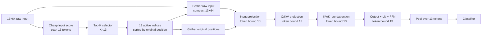

# Q16-ESLA Step 7A：HLS 实现前审计与实现计划

## 1. 审计范围与当前决定

本步骤只审计现有软件结果、现有 Q16 dense HLS 数据流，并补充 input-score fixed-K 软件 sweep。没有修改任何 HLS 源码，没有运行 HLS、Vivado 或 PYNQ，也没有生成或修改 bitstream。

当前决定：

- **不能直接采用 Hardware-first input-score K13**，因为三种 input score 的 K13 accuracy 均未达到允许门槛；
- 如果下一步获准进入 HLS，首版应实现 **版本 A：Faithful φ(K)-K13**；
- 必须把版本 A 描述为“post-K-selection token compute skipping”，不能声称 input projection 和 K projection 已被跳过；
- 版本 B 保留为后续研究方向，需要更好的 input score、训练或蒸馏后重新验证。

## 2. Q16-ESLA-K13 候选记录确认

来源：`real_event_sparse/results/esla_candidate_selection.csv`。

| 字段 | 值 |
|---|---:|
| candidate_name | Q16-ESLA-K13 |
| score_type | `phi_k` |
| selection_type | `fixed_topk` |
| fixed_k | 13 |
| accuracy | 94.5703% |
| F1 | 96.8439% |
| MAC reduction estimate | 12.0766% |
| BRAM-read proxy reduction | 15.9091% |

Dense Q16-S0 accuracy 为 94.1928%，因此 φ(K)-K13 在软件 reference 中通过 accuracy、稀疏率和 compute estimate 门槛。

## 3. Event score 的位置审计

当前 score 是：

```text
score_i = mean(abs(phi(K_i)))
K_i = W_K (input_projection(input_i) + position_i)
phi(x) = ELU(x) + 1
```

因此 φ(K) score **不能放在 input projection 前**。选择 active token 之前必须完成：

1. 全部 16 个 token 的 input projection；
2. 全部 16 个 token 的 position addition；
3. 全部 16 个 token 的 K projection；
4. 全部 16 个 token 的 φ(K)；
5. 全部 16 个 score 的 top-K selection。

现有软件 reference 也明确体现这一点：`prepare_scoring_state()` 在 `real_event_sparse/pytorch/esla_reference.py:125-139` 对完整输入生成 embedding 和 raw K；选择后 `compact_forward()` 在 `:141-185` 才 gather embedding/K；Q、V、attention、output、FFN 和 pooling 在 `:187-202` 处理 compacted T。

所以当前 12.08% MAC reduction 是保守地计入 dense input projection 与 dense K scoring 后的估算，不能解释成全模型所有 token loop 都由 16 变 13。

## 4. 版本 A：Faithful ESLA-K13

### 4.1 数据流

```mermaid
flowchart LR
    I[16×64 input] --> IP[Input projection<br/>loop bound 16]
    IP --> KF[K projection + phi(K)<br/>loop bound 16]
    KF --> SC[score 16 tokens]
    SC --> TK[Top-K selector<br/>K=13]
    TK --> IDX[13 active indices<br/>sorted by original position]
    IP --> GX[Gather x into compact x_c 13×D]
    KF --> GK[Gather selected K into compact K_c 13×D]
    IDX --> GX
    IDX --> GK
    GX --> QV[Q and V projection<br/>loop bound 13]
    GK --> ATT[KV/K_sum/attention<br/>token bound 13]
    QV --> ATT
    ATT --> POST[Output + LN + FFN<br/>token bound 13]
    POST --> POOL[Pool over 13 tokens]
    POOL --> CLS[Classifier]
```

### 4.2 必须是真实 compaction

实现只能采用以下结构：

```cpp
for (int a = 0; a < K_ACTIVE; ++a) {  // K_ACTIVE = 13
    int src = active_idx[a];
    x_compact[a] = x_full[src];
    k_compact[a] = k_full[src];
}

for (int a = 0; a < K_ACTIVE; ++a) {
    // Q/V and later token-path computation
}
```

禁止使用：

```cpp
for (int pos = 0; pos < SEQ_LEN; ++pos)
    if (selected[pos]) compute_or_write_zero(pos);
```

后者仍执行/调度 16-token loop，不得标记为有效 ESLA。

### 4.3 从 16 改为 13 的 loop

以当前 Q16 baseline `real_event_sparse/hls/q16_esla/src/imgds_linear_dense_q16.cpp` 为行号参考，版本 A 计划缩短：

| 当前阶段 | 当前行号 | 当前 bound | Faithful K13 bound | 说明 |
|---|---:|---:|---:|---|
| Q projection token 外层 | 当前融合于 96-119 | 16 | 13 | 需把 Q 从 dense K scoring path 拆开 |
| V projection token 外层 | 96-105 | 16 | 13 | 只为 compact token 生成 V |
| KV token reduction | 127-130 | 16 | 13 | 遍历 compact K/V |
| K_sum token reduction | 140-143 | 16 | 13 | 遍历 compact K |
| per-query output | 148-179 | 16 | 13 | 只生成 compact query 输出 |
| LayerNorm1 调用 | 268-269 | 16 | 13 | 每个 compact token 一次 |
| FFN token 外层 | 194-220 | 16 | 13 | 两层 FFN 与 residual 都只处理 compact token |
| LayerNorm2 调用 | 281-282 | 16 | 13 | 每个 compact token 一次 |
| mean pooling token reduction | 288-292 | 16 | 13 | 分母必须改为 13 |

attention 内 channel loops 仍保持 `D_MODEL=16`。K13 是 token sparsity，不能借此声称 channel loop 也减少。

### 4.4 不能减少的 loop

| 阶段 | 必须保持 16 的原因 |
|---|---|
| Input projection token loop（当前 245-254） | φ(K) score 依赖每个 token 的 projected embedding |
| K projection token loop | 未得到全部 K 就无法计算全部 φ(K) score并选 top-13 |
| φ(K) 与 score loop | selector 必须比较全部 16 个候选 token |
| Top-K candidate scan/selection | top-13 必须从全部 16 个 score 中选择 |
| 原始 input read/position access | 全部 token 参与 scoring front-end |

Classifier 的 token-independent `2×D_MODEL` 计算也不会因 K13 减少。

### 4.5 优缺点

优点：

- 与现有 φ(K)-K13 software reference 的 token ranking 和数值语义最接近；
- 软件 accuracy 94.5703%，已经通过门槛；
- Q/V、attention、output、LN、FFN 和 pooling 具有真实 13-token execution path。

缺点：

- input projection、K projection、φ(K) 和 top-K 都是 16-token front-end；
- top-K/φ 开销可能抵消一部分后端节省；
- 12.08% software MAC reduction 不能直接转换成 12.08% hardware latency reduction。

## 5. 版本 B：Hardware-first ESLA-K13-input

### 5.1 数据流



版本 B 的 selector 仍必须扫描 16 个 raw token，这是生成 active list 的必要低成本前端；但 input projection 及其后所有 MAC-heavy token loops 只处理 13 个 compact token。原 position index 必须随 token 一起保存，不能用 compact slot 0..12 替代原位置。

### 5.2 从 16 改为 13 的 loop

版本 B 比版本 A 多缩短：

- input projection；
- position embedding read/add；
- K projection 与 φ(K)（不再用作 score）；

并同样缩短 Q/V、KV/K_sum、per-query output、LN、FFN 和 pooling。

不能缩短的只有 raw input score scan、top-K selection 和 raw token/index inspection。若输入先从 AXI 读入再 scoring，原始输入读流量仍可能覆盖全部 16 token；后端 activation/weight access 才从 16 降到 13。

## 6. Input-score K13 软件补测

由于现有 fixed-K sweep 没有 input score，本步骤按分岔要求补充：

- `input_mean_abs`；
- `input_l2`；
- `input_delta_mean_abs`；
- K=14、13、12、11、10。

输出：`real_event_sparse/results/esla_inputscore_fixedk_sweep.csv`。

K13 关键结果：

| Score | Selection position | Accuracy | 相对 Dense 变化 | F1 | Dense match | MAC reduction estimate | 门槛 |
|---|---|---:|---:|---:|---:|---:|---|
| φ(K) | K projection 后 | **94.5703%** | +0.3775 pp | **96.8439%** | 96.7770% | 12.08% | 通过 |
| input_mean_abs | input projection 前 | 93.2056% | -0.9872 pp | 95.9530% | 97.9094% | 18.74% | **失败：accuracy** |
| input_l2 | input projection 前 | 93.2346% | -0.9582 pp | 95.9709% | **98.1127%** | 16.96% | **失败：accuracy** |
| input_delta_mean_abs | input projection 前 | 91.5505% | -2.6423 pp | 94.9135% | 96.3124% | 18.74% | **失败：accuracy** |

允许的最低 accuracy 是 Dense 94.1928% 减 0.3 pp，即 93.8928%。三个 input-score K13 均低于该值。因此不能因为版本 B 理论上跳过更多计算，就把它直接选为首版 HLS。

这里的 input-score MAC estimate 已按 pre-projection compact path 计算；`input_l2` 额外计入全输入平方操作，所以 reduction 小于只需 abs/add 的 score。它仍然只是软件运算量估算。

## 7. 当前是否可以直接进入 HLS

结论分两层：

1. **版本 B：不可以。** input-score K13 accuracy 明显低于允许门槛，应先改进 score、进行 ESLA-aware retraining/finetuning，或学习一个低成本 pre-projection gate，再重新软件验证。
2. **版本 A：具备进入下一步 HLS 设计的数值依据，但本步骤没有授权实现。** 下一步如果获准，应先实现 Faithful φ(K)-K13 的 CSIM reference path，并明确它只减少 selection 之后的 token loops。

因此推荐顺序为：

1. Faithful φ(K)-K13 HLS（首版真实 post-K compaction proof）；
2. K12 作为后续更激进 fixed bound；
3. 改进 input score/retraining 后再考虑 Hardware-first pre-projection K13；
4. 最后考虑 dynamic T80。

## 8. HLS 实现风险分析

### 8.1 Top-K 开销

S=16、K=13 等价于找出最低 3 个并保留其余项，可以比通用 full sort 简化，但必须保持与软件 top-k 的 tie-breaking/排序语义。比较器网络、插入排序或 serial selection 都会增加资源/周期。版本 A 还需要 φ(K) 的非线性计算；若复用当前 `expf` 路径，开销可能显著。

### 8.2 Dynamic indexing

`active_idx[a]` 对 x/K 或 raw input产生间接读取。HLS 可能综合为 mux 或非连续 RAM address，增加 LUT 和 critical path。建议 selection 后写入连续 compact buffer，使后续核心只访问 `[0..12]`，把随机访问限制在单独 compaction stage。

### 8.3 BRAM access pattern

版本 A 必须先写 full x/K buffer，再按 active index 读出并写 compact buffer；它不会减少 front-end x/K BRAM write。版本 B 可以更早 compact，但 score scan 仍读取全部 raw input。两个版本都必须从报告确认 buffer 的实际 RAM binding，不能仅凭 C++ 数组名称宣称 BRAM 减少。

### 8.4 Pipeline II 变差

top-K 的比较/更新存在 loop-carried dependency；indirect reads 也可能造成单端口 RAM conflict。若把 selector、gather 和 projection 强行放入一个 pipeline，II 可能恶化并抵消 3-token reduction。计划上应拆分 selection、compaction、dense-on-compact 三个阶段，并分别审计 II/latency。

### 8.5 Accuracy 与数值一致性

PyTorch score 使用 float φ(K)。Q16 fixed-point 的量化、ELU/exp approximation 和 score accumulation可能改变 K13 排名，尤其在相近 score 或 tie 时。必须比较 active index overlap、logits 和 prediction，而不只是最终 accuracy。

### 8.6 Pooling 与位置语义

pooling 分母必须为 13；位置编码必须使用 original token index。若 compact 后改用 0..12 的位置编码，模型语义将与软件 reference 不一致。

## 9. 下一步 HLS 的通过条件

未来获准实现版本 A 时，只有同时满足以下条件才能称为硬件真实稀疏：

1. source 中 Q/V、KV/K_sum、per-query、output、LN、FFN、pooling 的 token bound 为 13；
2. 不存在 `for < 16` 加 selected mask 的替代实现；
3. CSIM 的 active indices、logits、prediction 与 φ(K)-K13 software reference 对齐；
4. csynth 报告显示对应 loop trip count 从 16 降到 13；
5. MAC schedule/operation count 与 memory access estimate确有下降；
6. selector/compaction 开销单独报告；
7. 在 HLS 证据之前，不写成 hardware latency reduction；在 PYNQ 实测之前，不写成已经上板加速。

## 10. 最终建议

首版推荐：**Faithful Q16-ESLA-K13 with post-K top-K compaction**。

这不是最彻底的 pre-projection sparse，但它忠实于当前通过 accuracy 门槛的 φ(K)-K13 软件候选，并能真实减少后半段 token iteration、MAC 和 activation-buffer access。论文中必须明确 front-end input/K scoring 仍为 16-token dense execution。

Hardware-first input-score K13 暂不推荐进入 HLS：它更符合从输入前跳过 token 的理想结构，但当前 input-score accuracy 下降约 0.96–2.64 pp，不能用硬件友好性掩盖算法质量损失。

